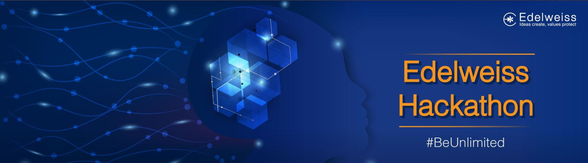

# Edelweiss Hackathon-Machine Learning

## Problem statements

* ### Machine Learning – Propensity to Foreclose

Predicting propensity of the customer to foreclose their loans. The objective is to retain the customer for the maximum tenure.

* ### Machine Learning – Portfolio & Price Prediction for Intra-day trades

Price movement prediction using a masked set of features - This involves predicting short-term to mid-term price movements using a combination of multiple features.

### Competition Link
https://www.hackerearth.com/challenges/competitive/machine-learning-Edelweiss/

### Leaderboard (3rd)
https://www.hackerearth.com/challenges/competitive/machine-learning-Edelweiss/leaderboard/
